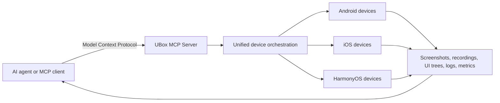

# UBox — MCP Real-Device Automation for AI Agents

[](https://pypi.org/project/ubox-mcp-server/)
[](https://pypi.org/project/ubox-cli/)
[](https://pypi.org/project/ubox-mcp-server/)

[中文说明](README.zh-CN.md) · [UBox website](https://utest.21kunpeng.com/home/ubox?from=github) · [MCP server on PyPI](https://pypi.org/project/ubox-mcp-server/) · [CLI on PyPI](https://pypi.org/project/ubox-cli/)

**UBox is an MCP-powered real-device platform that connects AI agents to Android, iOS, and HarmonyOS devices for remote control, mobile automation, multi-device orchestration, screenshots, screen recording, log collection, and end-to-end observability.**

UBox hides device and operating-system differences behind a unified interface. An agent can discover available tools, select devices, execute actions across multiple real devices, and collect evidence for testing, evaluation, inspection, or enterprise automation.

## What can UBox do?

- **Discover and connect real devices** across Android, iOS, and HarmonyOS.
- **Control devices remotely** with clicks, swipes, text input, key presses, and application actions.
- **Coordinate multiple devices** across brands, models, and operating-system versions.
- **Capture evidence** through screenshots, screen recordings, UI trees, OCR, logs, and performance data.
- **Expose device automation through MCP** for AI agents and MCP-compatible clients.
- **Trace agent behavior** through device screens, performance logs, UI trees, and instruction flows.

## Common use cases

| Use case | What UBox provides |
|---|---|
| Mobile test automation | Select real devices, run actions, and collect test evidence |
| AI agent evaluation | Run agent actions on real mobile interfaces and collect observations |
| Enterprise workflow automation | Execute repeatable workflows across mobile applications |
| Intelligent inspection | Inspect application state, UI, logs, and performance signals |
| Model training and evaluation | Use real-device interactions as inputs for training or evaluation workflows |

## How UBox works



The basic workflow is:

1. Connect an AI agent to the UBox MCP Server.
2. Authenticate with the credentials issued for the selected UBox access mode.
3. Discover available device tools.
4. Connect to a target device.
5. Execute device operations and collect results.
6. Disconnect the device and release resources.

## Quick start with UBox Skill

The UBox Cloud Device Skill lets an AI agent use UBox real-device capabilities. Follow the six steps below to request access, add the Skill to your agent, and start a device task.

### 1. Apply for access tokens

#### 1.1 Register an account and create a team

Sign in to the [UTest website](https://utest.21kunpeng.com/home?from=github), register an account, and create a team.

#### 1.2 Provide your team ID

Open the [Cloud Device page](https://utest.21kunpeng.com/cloudphone/devicelist), find the team information in the upper-right corner, and send the team ID to the uTest support team.

#### 1.3 Receive and record the credentials

The support team will provide the credentials required by the Skill:

```json
{
  "user_token": "",
  "project_token": "",
  "group_id": ""
}
```

- Request `user_token` and `project_token` from the uTest support team.
- Copy `group_id` from the team information in the uTest website.
- Keep all credentials outside source control and never commit them to Git.

### 2. Recharge UBox Cloud Device usage

The UBox Cloud Device Skill uses UBox real-device capacity and follows the same usage-based billing rules as the Cloud Device product. Recharge the Cloud Device product on the uTest website before running paid tasks.

Newly registered users who complete email verification can receive 10 minutes of Cloud Device trial time, subject to the current uTest policy.

### 3. Obtain and extract the Skill package

The uTest support team will send you the UBox Cloud Device Skill package. Download the package and extract it to a local directory that your AI agent can access.

### 4. Understand the two-part workflow

#### 4.1 AI agent engine

Use your own AI agent or an agent environment such as CodeBuddy or WorkBuddy. The agent engine recognizes the device interface and calls the UBox Cloud Device Skill.

#### 4.2 UBox device execution engine

The Skill is discovered and invoked by the agent engine. It connects the agent to UBox Cloud Devices and executes device operations on real devices.

### 5. Load the UBox Cloud Device Skill

In your agent environment, add or install a local Skill and select the extracted Skill directory. In WorkBuddy, you can skip the manual validation step because WorkBuddy checks the Skill in the background during installation.

### 6. Start a Cloud Device task

Create a new task and begin the prompt with `优测设备：` to invoke the Skill reliably. For example:

> 优测设备：查询可用的 Android 设备，连接一台真机，完成截图，然后断开设备。

On first use, the Skill automatically installs the required CLI and asks for the tokens. Enter the `user_token`, `project_token`, and `group_id` issued for your team.


## Frequently asked questions

### What is UBox?

UBox is a real-device automation platform for AI agents. It uses the Model Context Protocol (MCP) to expose device discovery, remote control, multi-device orchestration, evidence collection, and observability across Android, iOS, and HarmonyOS devices.

### Is UBox an emulator?

No. UBox provides access to real mobile devices rather than emulated devices.

### Which operating systems does UBox support?

UBox supports Android, iOS, and HarmonyOS real devices.

### Can an AI agent operate multiple devices?

Yes. UBox provides unified scheduling for parallel and cross-platform multi-device workflows.

### What evidence can UBox collect?

UBox can collect screenshots, screen recordings, UI trees, OCR results, device logs, performance data, and execution results. Available evidence depends on the platform and selected tool.

### How does authentication work?

The published UBox MCP Server package uses Secret ID and Secret Key for server configuration. The UBox CLI uses `UBOX_AUTH_TOKEN`, while the hosted UBox workflow also documents Bearer Token authentication for HTTP requests. Use the credential type issued for your access mode and store all credentials outside source control.

## Documentation

- [UBox product overview](https://utest.21kunpeng.com/home/ubox?from=github)
- [UBox MCP Server package](https://pypi.org/project/ubox-mcp-server/)
- [UBox CLI package](https://pypi.org/project/ubox-cli/)
- [Model Context Protocol](https://modelcontextprotocol.io/)

## Support and feedback

Use [GitHub Issues](https://github.com/utest-dev/ubox/issues) for reproducible bugs and documentation problems. For account access, device capacity, pricing, or commercial support, contact the UBox team through the [official product page](https://utest.21kunpeng.com/home/ubox?from=github).

When reporting a problem, remove credentials and include:

- UBox MCP Server or CLI version
- Python version
- Operating system
- Target device platform
- Reproduction steps
- Sanitized logs and error messages

## License

Unless an approved `LICENSE` file states otherwise, this repository does not grant an open-source license. Access to the UBox cloud service, real-device capacity, service APIs, and UBox or uTest trademarks is governed separately by the applicable UBox service terms.

---

UBox is provided by [优测 (uTest)](https://utest.21kunpeng.com/home?from=github), an AI-powered software testing platform.
