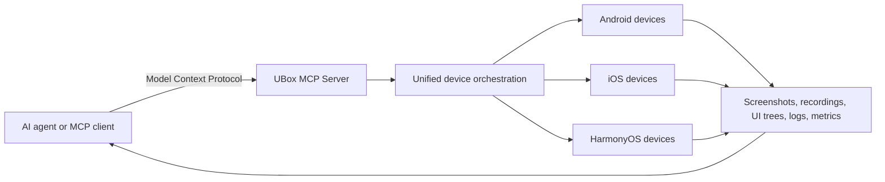

# UBox — MCP Real-Device Automation for AI Agents

[](https://pypi.org/project/ubox-mcp-server/)
[](https://pypi.org/project/ubox-cli/)
[](https://pypi.org/project/ubox-mcp-server/)

[中文说明](README.zh-CN.md) · [UBox website](https://utest.21kunpeng.com/home/ubox?from=github) · [MCP server on PyPI](https://pypi.org/project/ubox-mcp-server/) · [CLI on PyPI](https://pypi.org/project/ubox-cli/)

**UBox is an MCP-powered real-device platform that connects AI agents to Android, iOS, and HarmonyOS devices for remote control, mobile automation, multi-device orchestration, screenshots, screen recording, log collection, and end-to-end observability.**

UBox hides device and operating-system differences behind a unified interface. An agent can discover available tools, select devices, execute actions across multiple real devices, and collect evidence for testing, evaluation, inspection, or enterprise automation.

## What can UBox do?

- **Discover and connect real devices** across Android, iOS, and HarmonyOS.
- **Control devices remotely** with clicks, swipes, text input, key presses, and application actions.
- **Coordinate multiple devices** across brands, models, and operating-system versions.
- **Capture evidence** through screenshots, screen recordings, UI trees, OCR, logs, and performance data.
- **Expose device automation through MCP** for AI agents and MCP-compatible clients.
- **Trace agent behavior** through device screens, performance logs, UI trees, and instruction flows.

## Common use cases

| Use case | What UBox provides |
|---|---|
| Mobile test automation | Select real devices, run actions, and collect test evidence |
| AI agent evaluation | Run agent actions on real mobile interfaces and collect observations |
| Enterprise workflow automation | Execute repeatable workflows across mobile applications |
| Intelligent inspection | Inspect application state, UI, logs, and performance signals |
| Model training and evaluation | Use real-device interactions as inputs for training or evaluation workflows |

## How UBox works



The basic workflow is:

1. Connect an AI agent to the UBox MCP Server.
2. Authenticate with the credentials issued for the selected UBox access mode.
3. Discover available device tools.
4. Connect to a target device.
5. Execute device operations and collect results.
6. Disconnect the device and release resources.

## Quick start: UBox MCP Server

### Prerequisites

- Python 3.10 or 3.11
- UBox credentials
- An MCP client that supports Streamable HTTP or SSE

Request access through the [UBox product page](https://utest.21kunpeng.com/home/ubox).

### 1. Install

```bash
python -m pip install ubox-mcp-server
```

### 2. Configure credentials

The published `ubox-mcp-server` package documents Secret ID and Secret Key for server startup. Create a `.env` file:

```dotenv
UBOX_SECRET_ID=your_secret_id
UBOX_SECRET_KEY=your_secret_key
UBOX_MODE=normal
MCP_MODE=streamable-http
MCP_HOST=localhost
MCP_PORT=8000
```

The hosted UBox workflow also documents Bearer Token authentication for HTTP requests. Use the credential type supplied for your deployment or access mode; do not substitute one type for another. Never commit `.env` or credentials to Git.

### 3. Start the MCP server

```bash
ubox-mcp-server
```

### 4. Connect an MCP client

Example Cline configuration:

```json
{
  "mcpServers": {
    "ubox-mcp-server": {
      "transport": "http",
      "url": "http://localhost:8000/mcp",
      "description": "UBox MCP Server for real-device automation"
    }
  }
}
```

### 5. Verify tool discovery

```bash
curl -X POST http://localhost:8000/mcp \
  -H 'Content-Type: application/json' \
  -d '{"jsonrpc":"2.0","id":1,"method":"tools/list","params":{}}'
```

Then ask the connected agent to perform a task such as:

> List available Android devices, connect to one device, capture a screenshot, and disconnect the device.

## Command-line access with UBox CLI

Install the CLI:

```bash
python -m pip install ubox-cli
```

Add the authentication token to a `.env` file or export it in the shell:

```dotenv
UBOX_AUTH_TOKEN=your_token
```

Run a basic device workflow:

```bash
ubox-cli device list --platform android
ubox-cli device connect --udid DEVICE_UDID --os-type android
ubox-cli screen screenshot --udid DEVICE_UDID
ubox-cli device disconnect --udid DEVICE_UDID
```

The CLI also supports application management, UI and OCR lookup, clicks and gestures, screen recording, clipboard access, logs, performance collection, and Android/HarmonyOS diagnostics.

## Supported platforms

UBox officially describes unified real-device access for Android, iOS, and HarmonyOS. The available tools can vary by platform, device, account, and release. For example, the current UBox CLI documentation lists ADB, Logcat, and ANR/Crash diagnostics for Android and HarmonyOS only.

Before building an automated workflow, inspect the current tool list returned by the MCP server and verify each required operation on the target platform.

## Frequently asked questions

### What is UBox?

UBox is a real-device automation platform for AI agents. It uses the Model Context Protocol (MCP) to expose device discovery, remote control, multi-device orchestration, evidence collection, and observability across Android, iOS, and HarmonyOS devices.

### Is UBox an emulator?

No. UBox provides access to real mobile devices rather than emulated devices.

### Which operating systems does UBox support?

UBox supports Android, iOS, and HarmonyOS real devices.

### Can an AI agent operate multiple devices?

Yes. UBox provides unified scheduling for parallel and cross-platform multi-device workflows.

### What evidence can UBox collect?

UBox can collect screenshots, screen recordings, UI trees, OCR results, device logs, performance data, and execution results. Available evidence depends on the platform and selected tool.

### How does authentication work?

The published UBox MCP Server package uses Secret ID and Secret Key for server configuration. The UBox CLI uses `UBOX_AUTH_TOKEN`, while the hosted UBox workflow also documents Bearer Token authentication for HTTP requests. Use the credential type issued for your access mode and store all credentials outside source control.

## Documentation

- [UBox product overview](https://utest.21kunpeng.com/home/ubox)
- [UBox MCP Server package](https://pypi.org/project/ubox-mcp-server/)
- [UBox CLI package](https://pypi.org/project/ubox-cli/)
- [Model Context Protocol](https://modelcontextprotocol.io/)

## Support and feedback

Use [GitHub Issues](https://github.com/utest-dev/ubox/issues) for reproducible bugs and documentation problems. For account access, device capacity, pricing, or commercial support, contact the UBox team through the [official product page](https://utest.21kunpeng.com/home/ubox?from=github).

When reporting a problem, remove credentials and include:

- UBox MCP Server or CLI version
- Python version
- Operating system
- Target device platform
- Reproduction steps
- Sanitized logs and error messages

## License

Unless an approved `LICENSE` file states otherwise, this repository does not grant an open-source license. Access to the UBox cloud service, real-device capacity, service APIs, and UBox or uTest trademarks is governed separately by the applicable UBox service terms.

---

UBox is provided by [优测 (uTest)](https://utest.21kunpeng.com/home?from=github), an AI-powered software testing platform.
