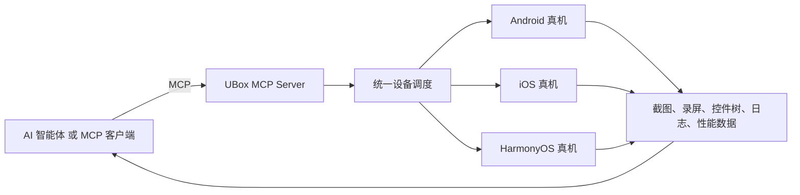

# UBox — 面向 AI 智能体的 MCP 真机自动化平台

[](https://pypi.org/project/ubox-mcp-server/)
[](https://pypi.org/project/ubox-cli/)
[](https://pypi.org/project/ubox-mcp-server/)

[English](README.md) · [UBox 官网](https://utest.21kunpeng.com/home/ubox?from=github) · [MCP Server](https://pypi.org/project/ubox-mcp-server/) · [CLI](https://pypi.org/project/ubox-cli/)

**UBox 是优测推出的智能体真机平台。它基于模型上下文协议（MCP），将 Android、iOS、HarmonyOS 真实终端接入 AI 智能体 工作流，提供设备查询、实时操控、多机协同、截屏录屏、日志采集和全链路可观测能力。**

UBox 屏蔽设备、系统和调度差异，让智能体通过统一接口选择设备、执行操作并采集证据，适用于自动化测试、智能体评测、企业流程自动化、智能巡检以及模型训练。

## 核心能力

- **真机发现与连接**：统一查询和连接 Android、iOS、HarmonyOS 真实设备。
- **远程设备操作**：支持点击、滑动、文本输入、按键和应用操作。
- **多机协同调度**：跨品牌、型号和系统版本并行执行任务。
- **测试证据采集**：获取截图、录屏、控件树、OCR、日志和性能数据。
- **MCP 标准接入**：将设备自动化工具暴露给 AI 智能体 和 MCP 客户端。
- **全链路可观测**：记录设备画面、性能日志、控件树和指令流。

## 典型场景

| 场景 | UBox 提供的能力 |
|---|---|
| 移动端自动化测试 | 自动选择真机、执行操作并采集测试证据 |
| AI 智能体 训练与评测 | 在真实移动界面上验证智能体操作效果 |
| 企业流程自动化 | 跨移动应用执行可重复的业务流程 |
| 智能巡检 | 检查应用状态、界面、日志和性能信号 |
| 多端兼容性验证 | 跨品牌、型号和系统版本并行执行任务 |

## 工作原理



标准流程包括：

1. AI 智能体 通过 MCP 连接 UBox MCP Server。
2. 使用当前 UBox 接入模式对应的凭证完成身份认证。
3. 查询可用的设备操作工具。
4. 连接目标设备。
5. 执行设备操作并采集结果。
6. 断开设备并释放资源。

## 快速开始：UBox MCP Server

### 前置条件

- Python 3.10 或 3.11
- UBox 访问凭证
- 支持 Streamable HTTP 或 SSE 的 MCP 客户端

可通过 [UBox 产品页](https://utest.21kunpeng.com/home/ubox?from=github)申请接入。

### 1. 安装

```bash
python -m pip install ubox-mcp-server
```

### 2. 配置凭证

当前已发布的 `ubox-mcp-server` 包使用 Secret ID 和 Secret Key 启动服务。新建 `.env` 文件：

```dotenv
UBOX_SECRET_ID=your_secret_id
UBOX_SECRET_KEY=your_secret_key
UBOX_MODE=normal
MCP_MODE=streamable-http
MCP_HOST=localhost
MCP_PORT=8000
```

UBox 官方托管流程还说明 HTTP 请求可使用 Bearer Token 认证。请使用团队为当前部署或接入模式提供的凭证类型，不要混用。不要将 `.env` 或真实凭证提交到 Git。

### 3. 启动服务

```bash
ubox-mcp-server
```

### 4. 配置 MCP 客户端

以 Cline 为例：

```json
{
  "mcpServers": {
    "ubox-mcp-server": {
      "transport": "http",
      "url": "http://localhost:8000/mcp",
      "description": "UBox MCP Server for real-device automation"
    }
  }
}
```

### 5. 验证工具发现

```bash
curl -X POST http://localhost:8000/mcp \
  -H 'Content-Type: application/json' \
  -d '{"jsonrpc":"2.0","id":1,"method":"tools/list","params":{}}'
```

连接后可向智能体发出任务：

> 查询可用的 Android 设备，连接一台真机，完成截图，然后断开设备。

## UBox CLI

安装 CLI：

```bash
python -m pip install ubox-cli
```

将 Token 写入 `.env` 文件，或在终端中导出环境变量：

```dotenv
UBOX_AUTH_TOKEN=your_token
```

执行基础设备流程：

```bash
ubox-cli device list --platform android
ubox-cli device connect --udid DEVICE_UDID --os-type android
ubox-cli screen screenshot --udid DEVICE_UDID
ubox-cli device disconnect --udid DEVICE_UDID
```

CLI 还支持应用管理、控件与 OCR 查找、点击与手势、屏幕录制、剪贴板、日志、性能采集，以及 Android/HarmonyOS 调试诊断。

## 常见问题

### UBox 是什么？

UBox 是面向 AI 智能体的真机自动化平台。它通过 MCP 暴露 Android、iOS、HarmonyOS 真实设备的发现、操控、多机调度、证据采集和可观测能力。

### UBox 是模拟器吗？

不是。UBox 提供真实移动终端，而不是模拟器。

### UBox 支持哪些系统？

UBox 支持 Android、iOS 和 HarmonyOS 真实设备。

### AI 智能体 能否同时操作多台设备？

可以。UBox 支持跨系统、多设备的统一调度和并行工作流。

### UBox 能采集哪些信息？

UBox 可采集截图、录屏、控件树、OCR 结果、设备日志、性能数据和执行结果。具体能力以当前平台和 MCP 工具列表为准。

### UBox 使用哪种认证方式？

当前 UBox MCP Server 包使用 Secret ID 和 Secret Key 配置服务；UBox CLI 使用 `UBOX_AUTH_TOKEN`；官方托管流程还说明 HTTP 请求可使用 Bearer Token。请按当前接入模式使用团队发放的凭证，并将所有凭证保存在源代码仓库之外。

## 文档与链接

- [UBox 产品介绍](https://utest.21kunpeng.com/home/ubox?from=github)
- [UBox MCP Server](https://pypi.org/project/ubox-mcp-server/)
- [UBox CLI](https://pypi.org/project/ubox-cli/)
- [Model Context Protocol](https://modelcontextprotocol.io/)

## 支持与反馈

可通过 [GitHub Issues](https://github.com/utest-dev/ubox/issues)反馈可复现的问题和文档错误。账号接入、设备容量、计费与商务支持请通过 [UBox 官方产品页](https://utest.21kunpeng.com/home/ubox?from=github)联系优测团队。

提交问题时，请移除凭证并提供：

- UBox MCP Server 或 CLI 版本
- Python 版本
- 本机操作系统
- 目标设备系统
- 复现步骤
- 已脱敏的日志和错误信息

## 许可证

除非经团队确认的 `LICENSE` 文件另有说明，本仓库不授予开源许可。UBox 云服务、真机资源、服务 API 以及 UBox 和优测商标的使用权，由适用的 UBox 服务条款另行约定。

---

UBox 由 [优测（uTest）](https://utest.21kunpeng.com/home?from=github)提供。优测是一站式 AI 软件测试平台。
